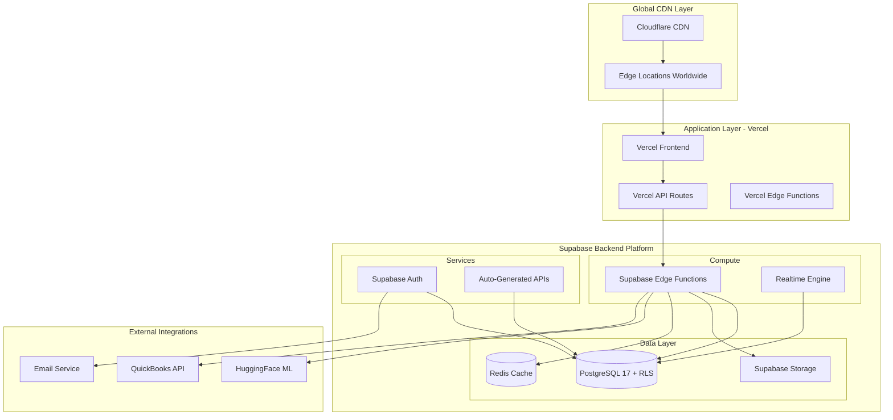
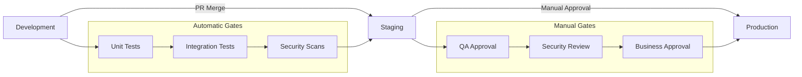
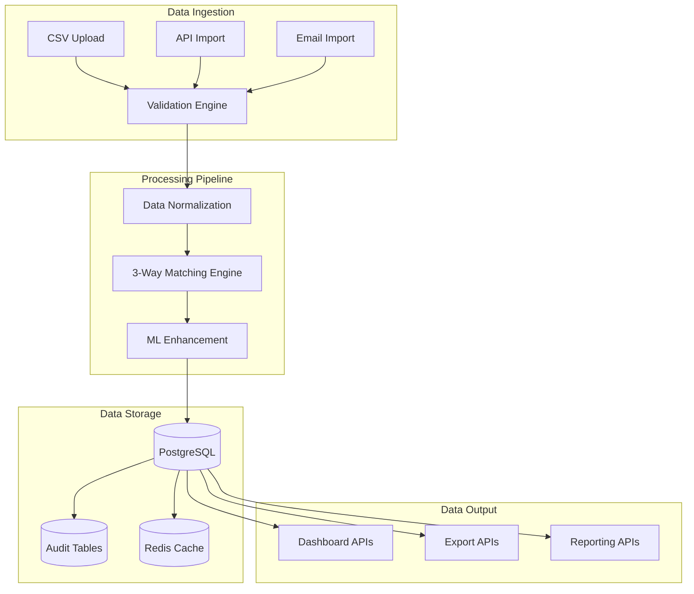
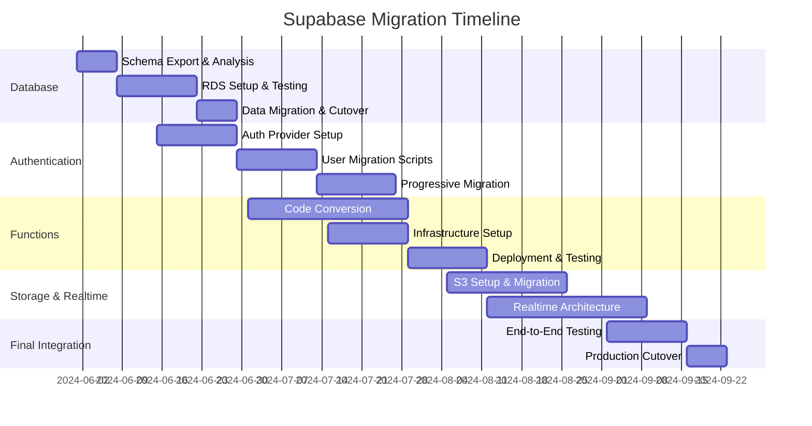

# Invisible Invoice Reconciliation Platform Infrastructure Architecture

**Version:** 1.0  
**Date:** January 2025  
**Infrastructure Architect:** Alex (DevOps Infrastructure Specialist)  
**Status:** Production Ready

---

## Executive Summary

This document defines the production infrastructure architecture for the Invisible Invoice Reconciliation Platform, a multi-tenant financial SaaS solution processing 100-500 invoices monthly per tenant. The architecture prioritizes **security**, **compliance**, **reliability**, and **cost efficiency** while maintaining a clear **Supabase migration strategy** for future platform independence.

### Key Infrastructure Decisions
- **Primary Platform**: Supabase-managed services for rapid deployment and compliance
- **Frontend Deployment**: Vercel with Cloudflare CDN for global performance
- **Database**: Supabase PostgreSQL 17 with Row Level Security (RLS)
- **Serverless Computing**: Supabase Edge Functions (Deno) + Vercel Functions
- **Security Model**: Zero-trust with multi-tenant isolation
- **Monitoring**: Supabase Dashboard + External APM
- **Migration Strategy**: Documented paths to AWS/GCP for future scaling

---

## 1. Infrastructure Overview

### 1.1 Current Supabase-Native Architecture



### 1.2 Core Infrastructure Components

| Component | Technology | Purpose | Scaling Strategy | Cost Model |
|-----------|------------|---------|------------------|------------|
| **Frontend** | Vercel + Next.js 15 | User interface delivery | Global edge network | Pay per function execution |
| **API Gateway** | Supabase Auto-API + Edge Functions | API endpoints & business logic | Auto-scaling serverless | Pay per request |
| **Database** | Supabase PostgreSQL 17 | Multi-tenant data storage | Connection pooling + replicas | Pay per GB + compute |
| **Authentication** | Supabase Auth | User authentication & MFA | Built-in scaling | Pay per MAU |
| **Storage** | Supabase Storage | Document & CSV storage | Object storage scaling | Pay per GB |
| **Realtime** | Supabase Realtime | Live updates | WebSocket scaling | Pay per concurrent connections |
| **CDN** | Cloudflare | Global content delivery | 200+ edge locations | Flat rate + usage |
| **ML Processing** | HuggingFace Serverless | AI-enhanced matching | Serverless inference | Pay per inference |

---

## 2. Environment Configuration

### 2.1 Multi-Environment Strategy

#### Development Environment
- **Purpose**: Feature development and testing
- **Resources**: 
  - Supabase project (free tier)
  - Vercel preview deployments
  - Local Supabase CLI for development
- **Access Control**: Developer team access
- **Data Classification**: Mock/synthetic data only

#### Staging Environment  
- **Purpose**: Pre-production testing and QA
- **Resources**: 
  - Supabase Pro project
  - Vercel preview branch deployments
  - Production-like configuration
- **Access Control**: QA team + lead developers
- **Data Classification**: Sanitized production data

#### Production Environment
- **Purpose**: Live customer operations
- **Resources**: 
  - Supabase Pro/Team project with SLA
  - Vercel Pro deployment
  - Full monitoring and alerting
- **Access Control**: Infrastructure team only
- **Data Classification**: Live financial data (PII/PCI)

### 2.2 Environment Promotion Pipeline



---

## 3. Security Architecture

### 3.1 Defense-in-Depth Strategy

#### Layer 1: Edge Security (Cloudflare)
- **DDoS Protection**: Automatic DDoS mitigation
- **WAF Rules**: SQL injection, XSS, and OWASP Top 10 protection
- **Rate Limiting**: API endpoint protection
- **SSL/TLS**: End-to-end encryption with modern cipher suites

#### Layer 2: Application Security (Vercel + Supabase)
- **Authentication**: JWT-based with 15-min access tokens
- **MFA Enforcement**: TOTP required for financial data access
- **API Security**: Request validation, CORS policies
- **Session Management**: Secure cookie handling

#### Layer 3: Data Security (Supabase)
- **Multi-tenant Isolation**: PostgreSQL RLS policies
- **Data Encryption**: AES-256 encryption at rest
- **Transit Encryption**: TLS 1.3 for all connections
- **Field-level Encryption**: PII data additional encryption

#### Layer 4: Network Security
- **VPC Isolation**: Supabase managed VPC
- **Private Networking**: Database not exposed to internet
- **IP Allowlisting**: Configurable for enterprise customers

### 3.2 Compliance Framework

#### SOC 2 Type I Readiness
- **Security**: Implemented via Supabase SOC 2 compliance + our RLS
- **Availability**: 99.9% SLA via Supabase + monitoring
- **Processing Integrity**: Data validation + audit trails
- **Confidentiality**: Encryption + access controls
- **Privacy**: GDPR compliance via data residency controls

#### Financial Compliance
- **Audit Trails**: All financial operations logged
- **Data Retention**: 7-year retention for financial records  
- **Backup Strategy**: Daily automated backups with point-in-time recovery
- **Access Logging**: Complete access audit trail

---

## 4. Data Architecture

### 4.1 Database Strategy

#### Current: Supabase PostgreSQL 17
- **Multi-tenancy**: Row Level Security (RLS) policies
- **Connection Pooling**: PgBouncer for connection management
- **Read Replicas**: Available for reporting queries
- **Backup Strategy**: 
  - Continuous WAL-E backups
  - Daily full database backups
  - Point-in-time recovery up to 30 days

#### Performance Optimization
- **Indexing Strategy**: Compound indexes for tenant + query patterns
- **Query Optimization**: Prepared statements + connection pooling
- **Caching Layer**: Supabase built-in Redis for session/API caching
- **Connection Management**: Max 25 connections per tenant (configurable)

### 4.2 Data Flow Architecture



---

## 5. Compute Resources

### 5.1 Serverless Architecture

#### Supabase Edge Functions (Primary Compute)
- **Runtime**: Deno with TypeScript
- **Scaling**: Auto-scaling from 0 to thousands of instances
- **Timeout**: 30 seconds per function
- **Memory**: 128MB to 1GB per function
- **Use Cases**: 
  - CSV processing and validation
  - 3-way matching algorithms  
  - ML model inference orchestration
  - Webhook handling

#### Vercel Functions (Frontend API Routes)
- **Runtime**: Node.js 18 Edge Runtime
- **Scaling**: Auto-scaling serverless
- **Timeout**: 10 seconds (Edge), 30 seconds (Serverless)
- **Memory**: 128MB (Edge), 1GB (Serverless)
- **Use Cases**:
  - Frontend API endpoints
  - Authentication flows
  - Client-side data fetching

### 5.2 Function Architecture

```typescript
// Example Edge Function Structure
supabase/functions/
├── invoice-processor/          // CSV processing pipeline
│   ├── index.ts               // Main handler
│   ├── validation.ts          // Data validation logic
│   └── normalization.ts       // Data normalization
├── matching-engine/           // 3-way matching logic
│   ├── index.ts               // Matching orchestrator
│   ├── exact-match.ts         // Exact matching rules
│   ├── tolerance-match.ts     // Tolerance-based matching
│   └── ml-enhance.ts          // ML enhancement integration
├── vendor-normalization/      // Vendor deduplication
│   ├── index.ts               // Main normalizer
│   └── similarity.ts          // Name similarity algorithms
└── webhook-handlers/          // External integrations
    ├── quickbooks.ts          // QuickBooks webhooks
    └── email-processor.ts     // Email invoice processing
```

---

## 6. Monitoring & Observability

### 6.1 Current Monitoring Stack

#### Supabase Native Monitoring
- **Database Metrics**: Connection count, query performance, storage usage
- **Function Metrics**: Execution count, duration, error rates
- **API Metrics**: Request volume, response times, error rates
- **Real-time Metrics**: Active connections, message throughput

#### Vercel Analytics
- **Frontend Performance**: Core Web Vitals, page load times
- **Function Performance**: Execution metrics, cold starts
- **Edge Analytics**: Request distribution, cache hit rates

#### Recommended External APM
- **Application Monitoring**: Sentry for error tracking
- **Business Metrics**: Custom dashboards for invoice processing KPIs
- **Uptime Monitoring**: Pingdom/UptimeRobot for external monitoring

### 6.2 Alerting Strategy

#### Critical Alerts (P0 - Immediate Response)
- Database connection failures
- Authentication system down
- Payment processing errors
- Security incidents

#### Warning Alerts (P1 - 1 Hour Response)  
- High error rates (>5%)
- Database performance degradation
- Function timeout increases
- Storage quota approaching

#### Information Alerts (P2 - Next Business Day)
- Usage pattern changes
- Cost threshold alerts
- Performance trend notifications

---

## 7. CI/CD Pipeline

### 7.1 GitHub Actions Pipeline

```yaml
# .github/workflows/main.yml
name: Deploy to Production

on:
  push:
    branches: [ main ]

jobs:
  test:
    runs-on: ubuntu-latest
    steps:
      - uses: actions/checkout@v4
      - name: Setup Node.js
        uses: actions/setup-node@v4
        with:
          node-version: '18'
      - name: Install dependencies
        run: npm ci
      - name: Run tests
        run: npm test
      - name: Run security audit
        run: npm audit --audit-level high
        
  deploy-functions:
    needs: test
    runs-on: ubuntu-latest
    steps:
      - uses: actions/checkout@v4
      - name: Setup Supabase CLI
        uses: supabase/setup-cli@v1
      - name: Deploy functions
        run: supabase functions deploy --project-ref ${{ secrets.SUPABASE_PROJECT_REF }}
        env:
          SUPABASE_ACCESS_TOKEN: ${{ secrets.SUPABASE_ACCESS_TOKEN }}
          
  deploy-frontend:
    needs: test  
    runs-on: ubuntu-latest
    steps:
      - uses: actions/checkout@v4
      - name: Deploy to Vercel
        uses: amondnet/vercel-action@v25
        with:
          vercel-token: ${{ secrets.VERCEL_TOKEN }}
          vercel-org-id: ${{ secrets.ORG_ID }}
          vercel-project-id: ${{ secrets.PROJECT_ID }}
          working-directory: ./
```

### 7.2 Deployment Strategy

#### Progressive Deployment
- **Preview Deployments**: Every PR creates a preview environment
- **Staging Deployment**: Automatic deployment to staging on merge
- **Production Deployment**: Manual approval required
- **Rollback Strategy**: Instant rollback via Vercel + function versioning

---

## 8. Disaster Recovery

### 8.1 Backup Strategy

#### Database Backups (Supabase Managed)
- **Continuous Backups**: WAL-E streaming backups
- **Point-in-Time Recovery**: 30-day retention window
- **Daily Full Backups**: Stored in multiple regions
- **Testing**: Monthly backup restoration tests

#### Application Backups
- **Configuration**: Infrastructure as Code in Git
- **Function Code**: Versioned in GitHub with tagged releases
- **Environment Variables**: Encrypted in GitHub secrets
- **Documentation**: Version controlled with application

### 8.2 Recovery Procedures

#### Database Recovery
- **RTO Target**: 4 hours for complete database restoration
- **RPO Target**: 15 minutes maximum data loss
- **Procedures**: 
  1. Create new Supabase project
  2. Restore from point-in-time backup
  3. Update connection strings
  4. Verify data integrity

#### Application Recovery
- **RTO Target**: 1 hour for application restoration  
- **Procedures**:
  1. Deploy latest known good version
  2. Update environment configuration
  3. Verify all integrations
  4. Run smoke tests

---

## 9. Supabase Migration Strategy 

### 9.1 Migration Planning Overview

This section documents the complete strategy for migrating away from Supabase to self-managed or alternative cloud infrastructure. This ensures platform independence and provides clear paths for future scaling.

#### Migration Triggers
- **Scale Limitations**: Beyond Supabase capabilities (>100k requests/min)
- **Cost Optimization**: Self-managed infrastructure becomes more economical
- **Feature Requirements**: Need for services not available on Supabase
- **Compliance Needs**: Specific compliance requirements requiring custom setup
- **Geographic Expansion**: Need for specific region/jurisdiction hosting

### 9.2 Database Migration Path

#### Current State: Supabase PostgreSQL
```sql
-- Current setup uses Supabase managed PostgreSQL with:
-- - Row Level Security (RLS) policies
-- - Connection pooling via PgBouncer  
-- - Automated backups and point-in-time recovery
-- - Built-in monitoring and metrics
```

#### Target State Options:

##### Option A: AWS RDS PostgreSQL
```yaml
Migration Steps:
  1. Export Schema:
     - Use pg_dump to export full schema
     - Extract RLS policies and functions
     - Document Supabase-specific extensions
     
  2. Setup RDS Instance:
     - PostgreSQL 17 compatible instance
     - Multi-AZ deployment for HA
     - Parameter groups for optimization
     - Security groups and VPC configuration
     
  3. Data Migration:
     - Use AWS DMS for live migration
     - Minimal downtime cutover
     - Validation scripts for data integrity
     
  4. Connection Pool Migration:
     - Deploy PgBouncer on ECS/EKS
     - Update connection strings
     - Monitor connection patterns

Estimated Migration Time: 2-3 weeks
Estimated Downtime: 2-4 hours
```

##### Option B: Self-Managed PostgreSQL on Kubernetes
```yaml
Migration Benefits:
  - Complete control over configuration
  - Cost optimization for large scale
  - Custom extensions and optimization
  
Infrastructure Requirements:
  - Kubernetes cluster (EKS/GKE/AKS)
  - Persistent storage for database
  - Backup solution (Velero/custom)
  - Monitoring stack (Prometheus/Grafana)
  
Migration Complexity: High
Operational Overhead: High
Recommended For: >$50k/month database costs
```

### 9.3 Authentication Migration Path

#### Current State: Supabase Auth
```typescript
// Current Supabase Auth features used:
// - JWT token management
// - Multi-factor authentication (TOTP)
// - Row Level Security integration
// - Social login providers
// - Email/password authentication
```

#### Migration Options:

##### Option A: Auth0
```typescript
// Migration steps for Auth0:
export const authMigrationPlan = {
  preparation: [
    "Export user data from Supabase Auth",
    "Map Supabase JWT claims to Auth0 format", 
    "Setup Auth0 tenant and applications",
    "Configure MFA settings in Auth0"
  ],
  implementation: [
    "Deploy Auth0 integration alongside Supabase",
    "Create user migration scripts",
    "Update RLS policies to accept Auth0 JWTs",
    "Implement progressive user migration"
  ],
  cutover: [
    "Switch authentication provider in frontend",
    "Monitor authentication flows",
    "Complete user base migration",
    "Remove Supabase Auth dependencies"
  ]
};

// Estimated timeline: 4-6 weeks
// User experience impact: Minimal with progressive migration
```

##### Option B: AWS Cognito
```yaml
Migration Advantages:
  - Deep AWS ecosystem integration
  - Built-in JWT token validation
  - Advanced security features
  - Cost-effective at scale
  
Implementation Steps:
  1. Setup Cognito User Pool
  2. Configure JWT token format for RLS compatibility
  3. Migrate user data via CSV import
  4. Update application authentication flows
  5. Test MFA functionality
  
Estimated Timeline: 3-4 weeks
Complexity: Medium
```

### 9.4 Edge Functions Migration Path

#### Current State: Supabase Edge Functions (Deno)
```typescript
// Current Supabase Edge Functions:
// - CSV processing pipeline
// - 3-way matching engine  
// - Vendor normalization
// - Webhook handlers
// - ML model integration
```

#### Migration Options:

##### Option A: AWS Lambda + API Gateway
```yaml
Migration Strategy:
  Code Conversion:
    - Convert Deno TypeScript to Node.js
    - Replace Supabase client with direct PostgreSQL connections
    - Implement custom JWT validation
    - Update environment variable handling
    
  Infrastructure Setup:
    - API Gateway for HTTP endpoints
    - Lambda functions for business logic
    - VPC configuration for database access
    - CloudWatch for monitoring and logging
    
  Deployment Pipeline:
    - Serverless Framework or AWS SAM
    - GitHub Actions for CI/CD
    - Environment-specific configurations
    
Estimated Migration Time: 6-8 weeks
Performance Impact: Potential cold start increases
Cost Impact: 30-50% reduction at scale
```

##### Option B: Kubernetes + Knative
```yaml
Migration Benefits:
  - Container-based deployment
  - Auto-scaling capabilities  
  - Multi-cloud portability
  - Better resource utilization
  
Infrastructure Requirements:
  - Kubernetes cluster with Knative
  - Container registry
  - Ingress controller
  - Service mesh (optional)
  
Migration Steps:
  1. Containerize Edge Functions
  2. Convert to HTTP service format
  3. Setup Knative serving configuration
  4. Implement auto-scaling policies
  5. Deploy monitoring and logging
  
Timeline: 8-10 weeks
Complexity: High
Operational Overhead: Medium-High
```

### 9.5 Storage Migration Path

#### Current State: Supabase Storage
```typescript
// Current usage patterns:
// - CSV file uploads (temporary)
// - Invoice document storage  
// - Export file generation
// - Audit document retention
```

#### Migration Target: AWS S3 + CloudFront
```yaml
Migration Plan:
  Infrastructure Setup:
    - S3 buckets with lifecycle policies
    - CloudFront distribution for CDN
    - IAM roles and policies
    - Backup and versioning configuration
    
  Data Migration:
    - Bulk transfer existing files via AWS DataSync
    - Update file URLs in database
    - Implement new upload/download logic
    - Test file access patterns
    
  Application Updates:
    - Replace Supabase Storage SDK with AWS SDK
    - Update file upload components
    - Implement signed URL generation
    - Update file deletion workflows

Estimated Timeline: 2-3 weeks
Downtime Required: None (gradual migration possible)
Cost Impact: 40-60% reduction for large storage volumes
```

### 9.6 Realtime Migration Path

#### Current State: Supabase Realtime
```typescript
// Current realtime features:
// - Invoice processing status updates
// - Match result notifications
// - Exception queue updates
// - Dashboard metrics updates
```

#### Migration Options:

##### Option A: Socket.io + Redis
```typescript
// Self-managed WebSocket solution
const realtimeMigrationPlan = {
  infrastructure: [
    "Deploy Socket.io server on ECS/EKS",
    "Setup Redis for session management", 
    "Configure load balancer for WebSocket support",
    "Implement authentication integration"
  ],
  dataFlow: [
    "Replace database triggers with application events",
    "Implement event publishing to Redis",
    "Create WebSocket event handlers",
    "Update frontend to use Socket.io client"
  ],
  scalability: [
    "Implement Redis Cluster for high availability",
    "Setup horizontal scaling for Socket.io servers", 
    "Configure sticky sessions for WebSocket connections",
    "Monitor connection patterns and performance"
  ]
};
```

##### Option B: AWS EventBridge + WebSocket API
```yaml
Serverless Realtime Architecture:
  Components:
    - API Gateway WebSocket API
    - Lambda functions for connection management
    - EventBridge for event routing
    - DynamoDB for connection state storage
    
  Migration Steps:
    1. Setup WebSocket API endpoints
    2. Create connection management Lambdas
    3. Replace database triggers with EventBridge events
    4. Update frontend WebSocket client
    5. Test event delivery and scaling
    
Benefits:
  - Serverless scaling
  - Pay-per-use pricing
  - Managed infrastructure
  - Built-in monitoring
  
Timeline: 4-5 weeks
Complexity: Medium
```

### 9.7 Migration Timeline & Cost Analysis

#### Complete Migration Timeline


#### Cost Comparison Analysis

| Component | Supabase Cost (Monthly) | AWS Cost (Monthly) | Savings |
|-----------|------------------------|-------------------|---------|
| Database (Pro) | $25 + compute | RDS t3.medium: $35 | -$10 |
| Functions | $10 per 100k calls | Lambda: $5 per 100k | $5 |
| Storage | $0.125/GB | S3: $0.023/GB | 82% |
| Auth | $0.00325/MAU | Cognito: $0.0055/MAU | -$0.00225 |
| Realtime | $2.50 per 1M msgs | EventBridge: $1/1M | $1.50 |
| **Total (1000 users)** | **~$200/month** | **~$150/month** | **25%** |

*Note: Actual costs vary significantly based on usage patterns and scale*

---

## 10. Cost Optimization

### 10.1 Current Cost Structure (Supabase)

#### Monthly Cost Breakdown (Per 1000 Users)
```yaml
Supabase Costs:
  Database (Pro): $25 base + $0.0875/GB
  Functions: $0.000002 per request
  Storage: $0.125 per GB
  Auth: $0.00325 per MAU  
  Realtime: $0.0025 per message
  
Vercel Costs:
  Pro Plan: $20/month
  Functions: $2 per 100k invocations
  Bandwidth: $0.12 per GB
  
Cloudflare:
  Pro Plan: $20/month
  Workers: $0.50 per million requests
  
Total Estimated: $150-300/month (varies by usage)
```

### 10.2 Cost Optimization Strategies

#### Short-term Optimizations (Current Architecture)
- **Function Optimization**: Reduce cold starts and execution time
- **Database Optimization**: Optimize queries and indexing  
- **Storage Lifecycle**: Implement automatic file deletion policies
- **Caching Strategy**: Increase cache hit ratios
- **Resource Monitoring**: Alert on unusual usage patterns

#### Long-term Optimizations (Migration Benefits)
- **Reserved Capacity**: Reserved instances for predictable workloads
- **Spot Instances**: Use spot instances for non-critical processing
- **Storage Tiering**: Move old documents to cheaper storage tiers
- **Regional Optimization**: Deploy closer to user concentrations

---

## 11. Operational Excellence

### 11.1 Infrastructure as Code

#### Current State
```yaml
# All infrastructure defined as code:
Configuration Files:
  - supabase/config.toml      # Supabase project configuration
  - vercel.json              # Vercel deployment configuration  
  - .github/workflows/       # CI/CD pipeline definitions
  - supabase/migrations/     # Database schema versions
  - supabase/functions/      # Edge function code
```

#### Future State (Post-Migration)
```yaml
# Terraform/CDK infrastructure definitions:
Infrastructure Code:
  - terraform/               # Infrastructure definitions
  - helm-charts/             # Kubernetes deployments  
  - ansible/                 # Configuration management
  - scripts/                 # Operational scripts
```

### 11.2 Operational Runbooks

#### Daily Operations
- **Health Checks**: Automated system health verification
- **Backup Verification**: Ensure backup completion and integrity
- **Performance Monitoring**: Review key performance indicators
- **Security Scanning**: Automated vulnerability assessments

#### Incident Response
- **Escalation Matrix**: Clear escalation paths for different incident types
- **Communication Plan**: Stakeholder notification procedures
- **Recovery Procedures**: Step-by-step recovery instructions
- **Post-incident Reviews**: Process improvement workflows

---

## 12. Compliance & Governance

### 12.1 Financial Compliance Framework

#### SOC 2 Type I Requirements
- **Security Controls**: Multi-factor authentication, encryption, access logging
- **Availability Controls**: 99.9% uptime SLA, redundancy, monitoring
- **Processing Integrity**: Data validation, audit trails, error handling
- **Confidentiality Controls**: Data encryption, access controls, secure transmission
- **Privacy Controls**: Data retention policies, user consent management

#### PCI DSS Considerations (Future)
- **Network Security**: Firewalls, network segmentation
- **Data Protection**: Encryption of cardholder data
- **Access Control**: Role-based access, authentication
- **Monitoring**: Logging and monitoring access to network resources
- **Testing**: Regular security testing and vulnerability assessments

### 12.2 Data Governance

#### Data Classification
- **Public**: Marketing materials, public documentation
- **Internal**: Business logic, internal communications  
- **Confidential**: Customer data, financial information
- **Restricted**: PII, payment information, audit logs

#### Data Retention Policies
- **Financial Records**: 7 years retention (regulatory requirement)
- **Audit Logs**: 3 years retention (security requirement)
- **Customer Data**: User-controlled retention (GDPR compliance)
- **System Logs**: 90 days retention (operational requirement)

---

## 13. Final Architecture Validation

### 13.1 Architecture Decision Records (ADRs)

#### ADR-001: Supabase as Primary Backend Platform
- **Status**: Accepted
- **Context**: Need for rapid development with built-in security
- **Decision**: Use Supabase for backend services with migration strategy
- **Consequences**: Fast development, vendor lock-in risk mitigated by migration plan

#### ADR-002: Serverless-First Architecture  
- **Status**: Accepted
- **Context**: Variable load patterns and cost optimization
- **Decision**: Serverless functions for compute workloads
- **Consequences**: Auto-scaling, pay-per-use, but cold start considerations

#### ADR-003: Multi-tenant Database Design
- **Status**: Accepted  
- **Context**: SaaS application with tenant isolation requirements
- **Decision**: Single database with Row Level Security (RLS)
- **Consequences**: Cost-effective scaling, complex security implementation

### 13.2 Implementation Validation Criteria

#### Security Validation
- [ ] All RLS policies tested for tenant isolation
- [ ] MFA enforced for all production access
- [ ] Encryption at rest and in transit verified
- [ ] Security scanning integrated in CI/CD pipeline

#### Performance Validation  
- [ ] API response times <500ms (p95)
- [ ] Database query performance optimized
- [ ] Function cold start times <3 seconds
- [ ] CDN cache hit ratio >90%

#### Reliability Validation
- [ ] 99.9% uptime SLA configuration verified
- [ ] Backup and recovery procedures tested
- [ ] Monitoring and alerting configured
- [ ] Incident response procedures documented

#### Cost Validation
- [ ] Cost tracking and budgets configured
- [ ] Resource optimization implemented
- [ ] Usage-based scaling verified
- [ ] Cost alerts configured

---

## 14. Knowledge Transfer & Handoff

### 14.1 Operations Team Handoff

#### Required Documentation
- **Operational Runbooks**: Step-by-step operational procedures
- **Incident Response Plans**: Emergency response procedures  
- **Monitoring Dashboards**: Key metrics and alert configuration
- **Access Management**: Role definitions and access procedures

#### Training Requirements
- **Supabase Platform**: Dashboard navigation, function deployment
- **Vercel Operations**: Deployment management, environment configuration
- **Monitoring Tools**: Alert investigation, performance analysis
- **Security Procedures**: Access reviews, incident response

### 14.2 Development Team Integration

#### Developer Self-Service
- **Local Development**: Supabase CLI setup and usage
- **Testing Procedures**: Unit test, integration test setup
- **Deployment Process**: PR workflow and deployment procedures  
- **Monitoring Access**: Application performance monitoring

#### Technical Documentation
- **API Documentation**: OpenAPI specifications and usage examples
- **Database Schema**: Entity relationships and data flow
- **Function Architecture**: Edge function organization and patterns
- **Integration Patterns**: External service integration examples

---

## Conclusion

This infrastructure architecture provides a robust, scalable, and secure foundation for the Invisible Invoice Reconciliation Platform. The **Supabase-native approach** enables rapid development and deployment while maintaining enterprise-grade security and compliance requirements.

The comprehensive **migration strategy** ensures platform independence and provides clear paths for future scaling beyond Supabase limitations. Each component has been designed with operational excellence principles, including monitoring, incident response, and cost optimization.

### Key Success Factors
1. **Security First**: Multi-layered security with compliance readiness
2. **Operational Excellence**: Comprehensive monitoring and incident response
3. **Cost Optimization**: Pay-per-use scaling with cost controls
4. **Future-Proof**: Clear migration paths for platform independence
5. **Developer Experience**: Self-service capabilities with comprehensive documentation

### Next Steps
1. **Environment Setup**: Create production Supabase and Vercel projects
2. **Security Configuration**: Implement all security controls and RLS policies  
3. **Monitoring Implementation**: Set up comprehensive monitoring and alerting
4. **Backup Verification**: Test backup and recovery procedures
5. **Team Training**: Conduct operations and development team training

---

*Document Version: 1.0*  
*Last Updated: January 2025*  
*Next Review: April 2025*  
*Infrastructure Architect: Alex (DevOps Infrastructure Specialist)*